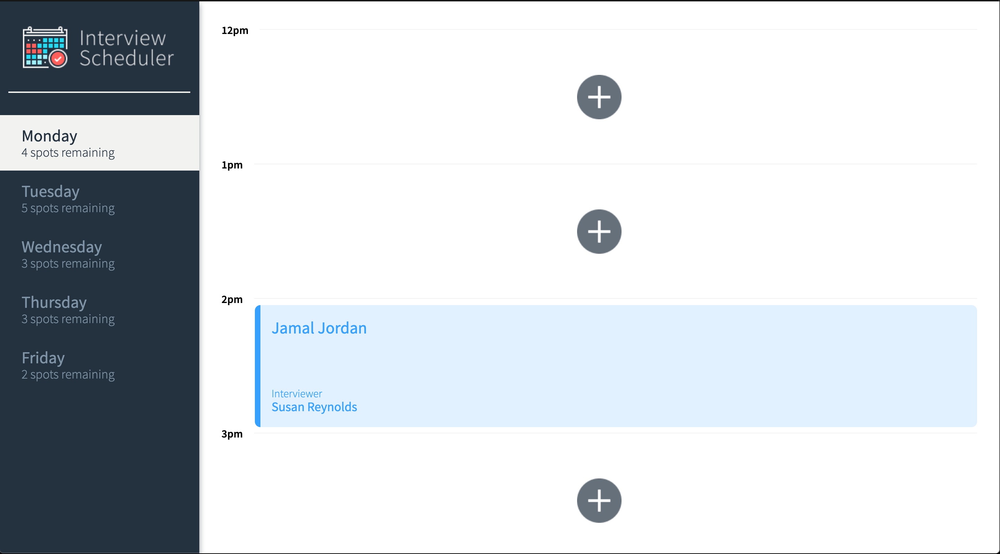
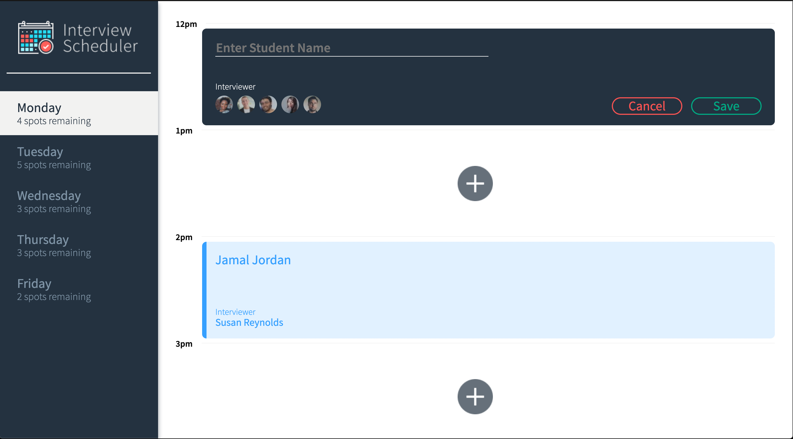
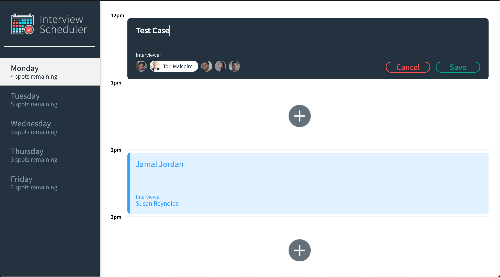
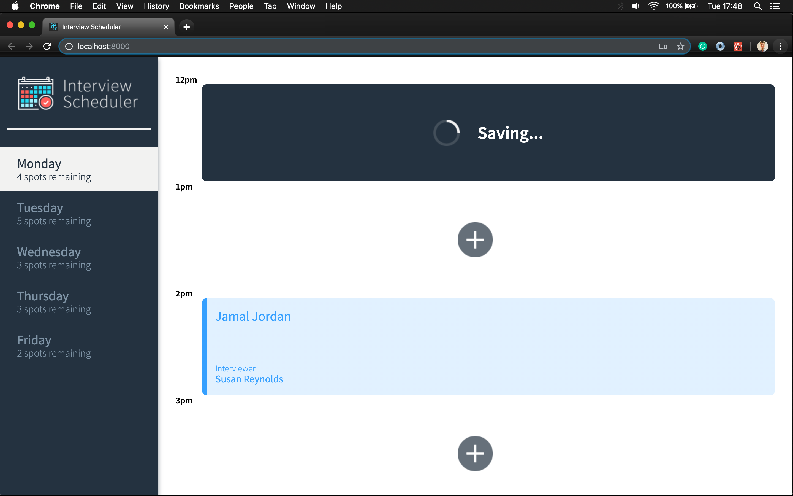
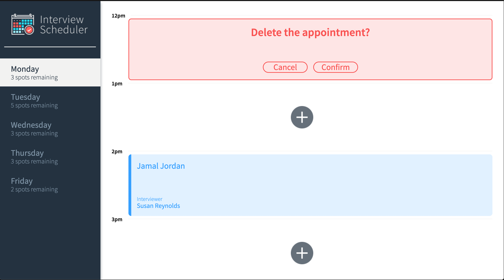

# Interview Scheduler

A small React app that allows users to book, edit and cancel interviews on multiple days of the week. The project uses a concise API with a WebSocket server to build a realtime experience. The app is built using react hooks and many other of the latest tools and techniques.

## Screen Shots

Main View

New Appointment

Filled Appointment

Saving

Delete Prompt



## Dependencies

- "axios": "^0.19.0"
- "classnames": "^2.2.6"
- "normalize.css": "^8.0.1"
- "react": "^16.9.0"
- "react-dom": "^16.9.0"
- "react-scripts": "3.0.0"

## Setup

Install dependencies with `npm install`.

## Running Webpack Development Server

```sh
npm start
```

## Running Jest Test Framework

```sh
npm test
```

## Running Storybook Visual Testbed

```sh
npm run storybook
```

## Backend Server API
The API is avaiable at: https://github.com/thidkyar/Interview-Schedular-Api
